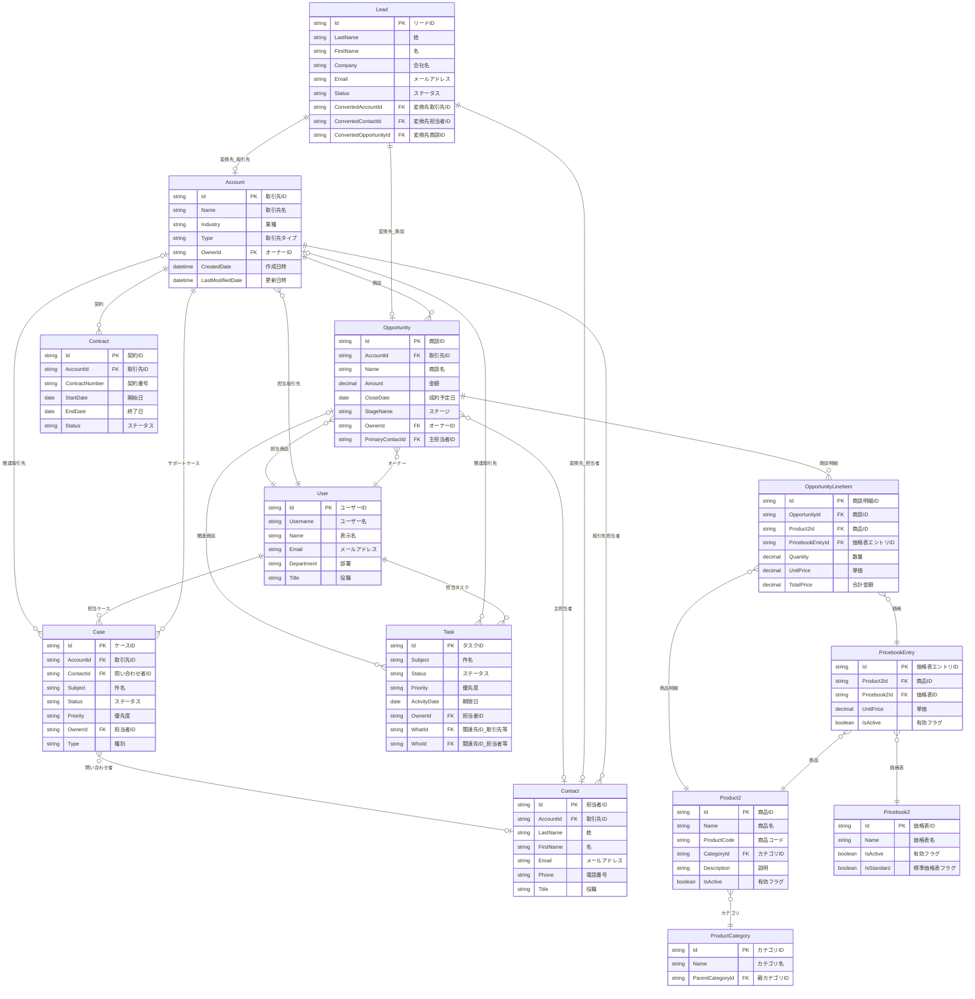

# Salesforce風データモデル 概念ER図

CRMの主要オブジェクトとその関係を表現した概念図です。

```mermaid
erDiagram
    Account ||--o{ Contact : "取引先担当者"
    Account ||--o{ Opportunity : "商談"
    Account ||--o{ Contract : "契約"
    Account ||--o{ Case : "サポートケース"

    Lead ||--o| Account : "変換先_取引先"
    Lead ||--o| Contact : "変換先_担当者"
    Lead ||--o| Opportunity : "変換先_商談"

    Opportunity ||--o{ OpportunityLineItem : "商談明細"
    Opportunity }o--|| User : "オーナー"
    Opportunity }o--o| Contact : "主担当者"

    User ||--o{ Account : "担当取引先"
    User ||--o{ Opportunity : "担当商談"
    User ||--o{ Task : "担当タスク"
    User ||--o{ Case : "担当ケース"

    Product2 ||--o{ OpportunityLineItem : "商品明細"
    Product2 }o--|| ProductCategory : "カテゴリ"
    PricebookEntry }o--|| Product2 : "商品"
    PricebookEntry }o--|| Pricebook2 : "価格表"
    OpportunityLineItem }o--|| PricebookEntry : "価格"

    Case }o--o| Account : "関連取引先"
    Case }o--o| Contact : "問い合わせ者"
    Task }o--o| Account : "関連取引先"
    Task }o--o| Opportunity : "関連商談"

    Account {
        string Id PK "取引先ID"
        string Name "取引先名"
        string Industry "業種"
        string Type "取引先タイプ"
        string OwnerId FK "オーナーID"
        datetime CreatedDate "作成日時"
        datetime LastModifiedDate "更新日時"
    }

    Contact {
        string Id PK "担当者ID"
        string AccountId FK "取引先ID"
        string LastName "姓"
        string FirstName "名"
        string Email "メールアドレス"
        string Phone "電話番号"
        string Title "役職"
    }

    Lead {
        string Id PK "リードID"
        string LastName "姓"
        string FirstName "名"
        string Company "会社名"
        string Email "メールアドレス"
        string Status "ステータス"
        string ConvertedAccountId FK "変換先取引先ID"
        string ConvertedContactId FK "変換先担当者ID"
        string ConvertedOpportunityId FK "変換先商談ID"
    }

    Opportunity {
        string Id PK "商談ID"
        string AccountId FK "取引先ID"
        string Name "商談名"
        decimal Amount "金額"
        date CloseDate "成約予定日"
        string StageName "ステージ"
        string OwnerId FK "オーナーID"
        string PrimaryContactId FK "主担当者ID"
    }

    OpportunityLineItem {
        string Id PK "商談明細ID"
        string OpportunityId FK "商談ID"
        string Product2Id FK "商品ID"
        string PricebookEntryId FK "価格表エントリID"
        decimal Quantity "数量"
        decimal UnitPrice "単価"
        decimal TotalPrice "合計金額"
    }

    Product2 {
        string Id PK "商品ID"
        string Name "商品名"
        string ProductCode "商品コード"
        string CategoryId FK "カテゴリID"
        string Description "説明"
        boolean IsActive "有効フラグ"
    }

    ProductCategory {
        string Id PK "カテゴリID"
        string Name "カテゴリ名"
        string ParentCategoryId FK "親カテゴリID"
    }

    Pricebook2 {
        string Id PK "価格表ID"
        string Name "価格表名"
        boolean IsActive "有効フラグ"
        boolean IsStandard "標準価格表フラグ"
    }

    PricebookEntry {
        string Id PK "価格表エントリID"
        string Product2Id FK "商品ID"
        string Pricebook2Id FK "価格表ID"
        decimal UnitPrice "単価"
        boolean IsActive "有効フラグ"
    }

    User {
        string Id PK "ユーザーID"
        string Username "ユーザー名"
        string Name "表示名"
        string Email "メールアドレス"
        string Department "部署"
        string Title "役職"
    }

    Task {
        string Id PK "タスクID"
        string Subject "件名"
        string Status "ステータス"
        string Priority "優先度"
        date ActivityDate "期限日"
        string OwnerId FK "担当者ID"
        string WhatId FK "関連先ID_取引先等"
        string WhoId FK "関連先ID_担当者等"
    }

    Case {
        string Id PK "ケースID"
        string AccountId FK "取引先ID"
        string ContactId FK "問い合わせ者ID"
        string Subject "件名"
        string Status "ステータス"
        string Priority "優先度"
        string OwnerId FK "担当者ID"
        string Type "種別"
    }

    Contract {
        string Id PK "契約ID"
        string AccountId FK "取引先ID"
        string ContractNumber "契約番号"
        date StartDate "開始日"
        date EndDate "終了日"
        string Status "ステータス"
    }
```
